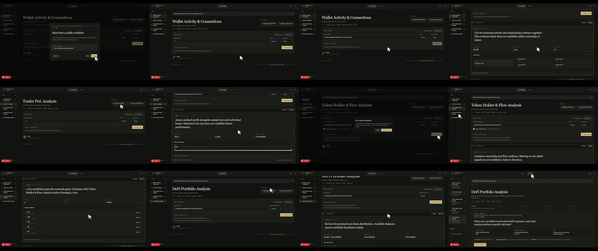

# Nansen 360 NoScope

**A beginner-friendly workspace for learning and conducting on-chain investigations with live Nansen data.**

Nansen 360 NoScope turns wallet, trader, token, Smart Money, and DeFi data into guided workflows with plain-English summaries, visual evidence, and transparent query logs.

> Choose a tool → add your own key → confirm the cost → review the evidence.

[Open the live app](https://nansen360noscope.vercel.app) · [Watch the 60-second demo](./videos/nansen360noscope-launch/assets/nansen360noscope-submission-silent.mp4) · [Read the analyst guide](./ANALYST_GUIDE.md)



## Why I built it

This is my entry for the Nansen Meridian Buildathon. I discovered the buildathon late and built the first version over one weekend.

I had not used Nansen for deep research before, so the first problem was learning how to interpret the data responsibly. That knowledge gap became the product idea: begin with guided learning, then turn the same method into practical investigation tools.

The project was fully vibe coded in a short amount of time. Some rough edges—particularly in the copy and explanations—are expected. I plan to keep improving it as I learn more about Nansen and on-chain research.

This is an independent project built with the Nansen API. It is not an official Nansen product.

## What it does

The app organizes on-chain research around five questions:

| Tool | Question it helps answer | Main evidence |
| --- | --- | --- |
| **Wallet Activity & Connections** | What does this wallet hold, do, and connect to? | Balances, transactions, counterparties, funders, and related wallets |
| **Trader PnL Analysis** | Is this trader consistently profitable or dependent on a small number of trades? | Realized PnL, token-level results, DEX trades, losses, and concentration |
| **Token Holder & Flow Analysis** | Who owns this token, and where is capital moving? | Holder concentration, Smart Money flows, exchange flows, buyers, and sellers |
| **Smart Money Token Screener** | Which tokens pass the selected research filters? | Liquidity, labelled-wallet participation, netflows, and holder checks |
| **DeFi Portfolio Analysis** | Where is this wallet deployed and concentrated? | Wallet balances, protocols, chains, supplied assets, positions, and available debt data |

## Example uses

- Trace a wallet's activity, recurring counterparties, and possible relationships.
- Check whether a trader's headline profit survives after removing its largest winner.
- Examine token concentration alongside Smart Money and exchange flows.
- Build a shortlist of tokens that meet selected liquidity and wallet-participation filters.
- Compare a wallet's liquid assets with its deployed DeFi positions.
- Move from a screened token into a deeper holder-and-flow investigation.
- Save investigation snapshots locally for later comparison.
- Learn a repeatable research process without spending API credits.

The app treats connections and signals as research leads rather than proof. A related wallet does not automatically establish common ownership, and a token passing a screen is not a buy recommendation.

## Key features

- Five focused investigation tools using live Nansen data.
- **Investigate** is the default experience.
- Two sourced public workflows for every tool.
- Plain-English conclusions with supporting metrics and evidence tables.
- Wallet-connection, activity, performance, flow, candidate, and portfolio visualizations.
- Expandable raw evidence and per-request query logs.
- Estimated request and credit cost shown before confirmation.
- Per-tool analysis guides and a separate no-credit **Learn** mode.
- Ethereum, Base, Arbitrum, Polygon, BNB Chain, and Solana support where the selected tool allows it.
- Saved investigations stored locally in the browser.
- Responsive desktop and mobile layouts.
- Bring-your-own-key access with no shared project API key.

## How to use it

1. Open **Investigate** and choose the question you want to answer.
2. Add your Nansen API key for the current browser tab.
3. Enter a wallet or token address, or load a public workflow.
4. Select the chain, time window, and any tool-specific filters.
5. Review the estimated requests and credits.
6. Confirm the live investigation.
7. Read the summary, then inspect the underlying evidence and query log.
8. Save useful results locally if you want to revisit them.

Each tool includes a compact **Analysis guide**. The full [Analyst Guide](./ANALYST_GUIDE.md) explains the metrics, evidence order, common mistakes, and limits of each conclusion.

## Bring your own API key

The deployed application does not use a shared Nansen credential. Each visitor supplies their own key.

- The key is held in React memory for the current browser tab.
- The app does not write it to local storage, session storage, cookies, URLs, saved investigations, logs, or the repository.
- On a confirmed run, the browser sends it over HTTPS to the same-origin API route.
- The route transiently forwards it to Nansen and does not store or return it.
- Reloading or closing the tab clears it. It can also be cleared from the interface.
- Fixed server adapters determine which upstream Nansen endpoints can be called.

The key necessarily passes through the server route while a request is processed. “Tab memory” means the app does not persist it—not that the route never receives it.

For additional protection, create a dedicated, revocable Nansen key for this app. If your Nansen account supports per-key credit or rate limits, use conservative limits and monitor usage.

Anyone who prefers local key handling can download the public repository and run the app locally.

## Live API validation

The integration was tested with a purpose-built validation runner:

- **106 of 106 live calls succeeded**
- **11 distinct Nansen endpoints**
- **106 unique request fingerprints**
- **130 credits reported by response headers**
- All five product areas covered
- No authentication, authorization, timeout, network, rate-limit, or HTTP failures during the run

The requests varied public wallets and tokens, chains, time windows, pagination, and screening thresholds. The generated reports exclude API keys and response payloads.

Read the complete [API validation summary](./API_VALIDATION.md) or inspect [`scripts/validate-nansen-api.mjs`](./scripts/validate-nansen-api.mjs).

## Run locally

Requirements:

- Node.js `>=22.13.0`
- A Nansen API key for live investigations

```bash
git clone https://github.com/aizzaku/nansen360noscope.git
cd nansen360noscope
npm ci
npm run dev
```

Open [http://localhost:5173](http://localhost:5173), add your key in the interface, and choose a workflow. You do not need to configure a server-side key.

The optional API-validation runner accepts `NANSEN_API_KEY` from the local shell or an ignored `.env.local` file. That variable is only for the standalone validation script—not the deployed application.

## Deploy on Vercel

1. Import this repository into Vercel.
2. Keep the repository root as the project root.
3. Use the Next.js framework preset and the repository's default install/build commands.
4. Do **not** add a visitor API key or `NANSEN_API_KEY` to Vercel environment variables.
5. Deploy and test the BYOK flow in a private browser window.

Because the application is BYOK, every visitor's Nansen account is responsible for its own API access and credits.

## Verification

```bash
npm run lint
npx tsc --noEmit
npm run build
```

## Current limitations

- Conclusions are generated from fixed evidence rules rather than an open-ended AI analyst.
- Saved investigations remain on the current device and are not synchronized.
- Available metrics depend on the selected Nansen endpoint and subscription access.
- DeFi liquidation risk cannot be inferred when protocol-specific health data is unavailable.
- Public workflows provide research starting points, not current ownership claims or investment advice.
- The first version prioritizes a working research flow over perfectly refined copy and visualization.

## Next steps

The next goal is to make every output faster to understand through cleaner charts, wallet flows, relationship maps, and visual explanations wherever they add real value. Other planned improvements include clearer metric definitions, stronger report exports, and more polished mobile investigation views.

## Stack

Next.js 16, React 19, TypeScript, Tailwind CSS 4, Base UI/Radix components, Lucide icons, Recharts, and Zod.

## Disclaimer

Nansen 360 NoScope is an educational and research tool. It does not provide investment advice, guarantee wallet attribution, or turn rankings and labels into trading recommendations. Always inspect the underlying evidence and consider alternative explanations.
